# Spring-Boot-Microservices----Full-Stack-with-Kubernetes-CI-CD-AWS


> End-to-end implementation of a production-grade microservices system from building Spring Boot services and an Angular frontend, to deploying on AWS EKS with a full GitOps pipeline powered by ArgoCD.

---

## Table of Contents

- [Overview](#-Overview)
- [Architecture Project](#-Architecture-Project)
- [Repository Structure](#-repository-structure)
- [Microservices](#-Microservices)
- [Frontend — Angular](#-frontend--angular)
- [Profiling](#-Profiling)
- [Containerization — Docker](#-containerization--docker)
- [Kubernetes](#-kubernetes)
- [AWS](#-aws)
- [Testing](#-Testing)
- [CI/CD Pipeline](#-cicd-pipeline)
- [GitOps with ArgoCD](#-gitops-with-argocd)

---

## Overview

This project documents the complete journey of designing, building, and deploying a microservices-based application from scratch. Each phase represents a real-world challenge:

| Phase | Topic |
|-------|-------|
| 1 | Designing microservices with Spring Boot |
| 2 | Service discovery with Eureka |
| 3 | Inter-service communication (REST) |
| 5 | Angular frontend |
| 6 | Dockerizing all services |
| 7 | Profiling |
| 8 | AWS EKS cluster provisioning |
| 9 | Cloud databases (AWS RDS & MongoDB Atlas) |
| 10 | Kubernetes |
| 11 | Manifest files |
| 12 | AWS Load Balancer & ingress |
| 13 | CI/CD & GitOps with Jenkins / ArgoCD |

---

## Architecture Project

Within this microservice architecture, the entire functionality is split in independent deployable module which communicate with each other through API’s(RESTful web services)

---

## Repository Structure


---

## Microservices

All microservices share the same core stack we create simple microservices : **Java 17 · Spring Boot 4.0.1 · Spring Data JPA · MySQL/MangoDB · MapStruct · Lombok · Eureka  · Docker**
with Web MVC Architecture :

- Controller layer
- Service Layer
- Repo Layer
- Entity
- DTO layer

###  Eureka Service Registry

**Repo:** [food-delivery-eureka-service](https://github.com/Oussama-lasri/food-delivery-eureka-service) ·

Central discovery server. All microservices register here on startup and use Eureka to locate each other — no hardcoded URLs.

###  User Info Service

**Repo:** [food-delivery-user-info-service](https://github.com/Oussama-lasri/food-delivery-user-info-service) ·
Manages user profiles and personal information.

#### Tech stack used

- Microservice architecture
- Rest APIs
- Java 17
- MySql Relational DB as Datasource
- Spring Boot
- Lombok
- Eureka Client
- mapstruct

###  Food Catalogue Service

**Repo:** [food-delivery-food-catalogue-service](https://github.com/Oussama-lasri/food-delivery-food-catalogue-service) ·

Manages the food item catalogue categories, items, prices and availability.
Food Catalogue Microservice is responsible toList all food items list of that particular Restaurant and
Complete Restaurant Details

#### Tech-stack used

- Microservice architecture
- Rest APIs
- Java 17
- MySql Relational DB as Datasource
- Spring Boot
- Lombok
- Eureka Client
- mapstruct

###  Restaurant Listing Service

**Repo:** [food-delivery-restaurant-listing-service](https://github.com/Oussama-lasri/food-delivery-restaurant-listing-service) ·

Handles restaurant data — listing, filtering, and details.

#### Tech-stack used

- Microservice architecture
- Rest APIs
- Java 17
- MySql Relational DB as Datasource
- Spring Boot
- Lombok
- Eureka Client
- mapstruct

###  Restaurant Order Service

**Repo:** [food-delivery-order-service](https://github.com/Oussama-lasri/food-delivery-order-service) ·

When we Hit OrderNow button,  the order details and user id reached backed, This MS saves all order details like :

- Food items list
- Restaurant details
- User Information

#### Tech stack used

- Microservice architecture
- Rest APIs
- Java 17
- MongoDB DB as Datasource
- Spring Boot
- Lombok
- Eureka Client
- mapstruct

---

## Frontend — Angular

A lightweight Angular  application that communicates with the backend through the API.

---

## Containerization - Docker

Containerization allows applications to be packaged along with their dependencies, such as libraries and configuration files, into lightweight, portable units called containers.

Each service has its own `Dockerfile` with simple instructions .

```dockerfile
# Example: Spring Boot service
FROM eclipse-temurin:17-jdk
WORKDIR /opt
COPY target/*.jar /opt/app.jar
ENTRYPOINT exec java $JAVA_OPTS -jar app.jar
```

**Build and Push Image** : 
Build image : `docker build -t user-name/app-name:0.0.1 .`
Push image to DockerHub : `docker push user-name/app-name:0.0.1`

## Profiling

### What is Spring Boot profiling

**Configuration Files**: Spring Boot allows you to define multiple configuration files, each associated with a specific profile. These files are typically named application-{profile}.properties or application-{profile}.yml, where {profile} is the name of the profile.

**Application Properties**: Inside each profile-specific configuration file, you can specify different properties based on your requirements. These properties can include database connection details, logging settings, cache configurations, and any other application-specific configurations.

**Activating Profiles**: You can activate a specific profile by setting the spring.profiles.active property. This can be done in various ways, such as by setting an environment variable, using the -D flag when running the application, or programmatically in code.
For example, to activate the development profile, you can set `spring.profiles.active=development`.

### How profiling works in Spring Boot

Configuration Files: Spring Boot allows you to define multiple configuration files, each associated with a specific profile. These files are typically named a`pplication-{profile}.properties` or `application-{profile}.yml`, where {profile} is the name of the profile.

Application Properties: Inside each profile-specific configuration file, you can specify different properties based on your requirements. These properties can include database connection details, logging settings, cache configurations, and any other application-specific configurations.

Activating Profiles: You can activate a specific profile by setting the `spring.profiles.active` property. This can be done in various ways, such as by setting an environment variable, using the `-D` flag when running the application, or programmatically in code.
For example, to activate the development profile, you can set `spring.profiles.active=development`

e.g. :


## Kubernetes

### Definition

also known as K8s, is an open source system for automating deployment, scaling, and management of containerized applications.

### Why Kubernetes ?

- Simplified Deployment
- Automated Scaling and Load Balancing
- Self-Healing and Fault Tolerance
- Rollouts and Rollbacks
- High availability with technically no downtime
- Kubernetes makes it easier to develop, deploy, and manage applications. allowing developers and operations teams to focus more on delivering value and less on infrastructure management.
<!-- - Kubernetes provides a framework for managing and running these containers across a cluster of machines.
- Orchestration involves managing the lifecycle of containers, including their deployment, scaling, networking, storage, and monitoring. Kubernetes acts as the central control plane that automates and coordinates these tasks, ensuring that the desired state of the application or system is maintained. -->

### Components of K8s

#### NODE

You need to deploy  your app on a physical server or VM (Virtuel Machine) and that machine is called a worker node or “node”  Or a Slave
the place when deploy all the application

#### POD

- A Pod is the smallest deployable unit in Kubernetes.
- Pods live on Nodes
- A Pod contains one or more containers.but in real time scenarios we will see maximum 1 container inside each POD
- Each POD has its own IP Address
- Each POD can communicate using These IP addresses
- But if POD crashes then? Will u change mapping Everytime the POD crashes?

#### Service

- a service provides a consistent and reliable way to access and communicate with a group of pods. (“How other services talkto my app”)
- Provides permanent IP address to PODs
- Load balancing
- internal exposure

##### types of service

- **ClusterIP :** This is the default service type. It exposes the service on an internal IP within the cluster, and it is only accessible from within the cluster.
- **NodePort :** Define your service with a **type: `NodePort`** in its Service specification.
    This type exposes the service on a specific port of each cluster node's IP address. It makes the service accessible from outside the cluster by using the node's IP address and the assigned NodePort.

- **Note**: This approach is typically used for development or testing purposes and may not be suitable for production deployments.
- **Load Balancer:** This type provisions an external load balancer (e.g., from a cloud provider) that directs traffic to the service. It automatically assigns an external IP address, making the service accessible from outside the cluster.

**conclusion** : the service works as a service that enable communication inside or outside the cluster .
Pods in Kubernetes are mortal and can be created or destroyed for reasons like scaling, updates, or node failures, causing their IP addresses to change frequently. A Service decouples the application's clients from the underlying Pods, providing a stable, persistent way to access the application without needing to track individual Pod IPs.


#### ConfigMap & Secrets

#### ConfigMap

- ```ConfigMap``` is used to store configuration data that can be consumed by containers
running in pods.
- It provides a way to decouple the configuration from the application code, allowing for
easy configuration changes without modifying the container image.
- Else every time you have to rebuild the application then push it to the repository and
then pull that new image in your pod and restart the whole thing
- Thus you can separate the configuration concerns from the application logic, making it
easier to manage and update the configuration independently of the container images.
It promotes flexibility, maintainability, and portability in a Kubernetes environment.

e.g. :

#### Secrets

- ```secret``` is just like configmap but the difference is that it's used to store secret data
credentials for example and it's stored not in a plain text format of course but in base64
encoded format.
- ```Secret``` is used to store and manage sensitive information, such as passwords, API keys,
tokens, or certificates. Secrets provide a way to securely store and distribute sensitive
data to containers running in pods.

e.g. :

#### volumes

- ```Volumes``` are a way to provide persistent storage to containers running in pods . It plays a crucial role in managing and persisting data in Kubernetes.

- They enable containers to work with shared and persistent storage, allowing for data integrity, data sharing between containers, and reliable data storage beyond the lifecycle of individual containers.

- Means even if your DB Pod crashes, your data is safe in volumes .

- If you don’t use them, then your data will reside in PODs. Pods are designed to be crashable units and when they crash, all your data is gone !!

- But now if u replicate these DB Pods, they must use same Volumes for data consistency so it’s always advisable to move these DB to some external DB services like AWS RDS services, Azure DBs

#### Replicas Sets

question : How to create Replicas sets in K8s ?

- For High available , fault tolerance and load balancing we need replicate sets for same pod

- So if I need 3 Replica set of each application will u create 3 pods manually ?.

- Answer is NO !! we never work at POD level. We work at Deployment level.

#### deployments

- `Deployment`in Kubernetes is like a blueprint or set of instructions for running and managing your application.

- Think of a Deployment as a manager for your application. It ensures that the desired number of copies of your application are always running, even if a pod or node fails. If you want to scale your application, you can simply tell the Deployment to add more replicas, and it will automatically create and manage them for you.

- Deleting Deployment will delete Pods, replica sets but will not delete services, ConfigMaps, Secrets, and any associated persistent volumes.

#### statefulSets

- `StatefulSet` in Kubernetes is a way to manage applications that need to maintain their identity and persist data, such as databases.

- `StatefulSets` also ensure that each pod has its own persistent storage, so data can be stored and retrieved even if the pod is terminated or moved to a different node. This is important for applications that need to keep their data intact, like databases.

- `StatefulSets` provide a way to deploy, scale, and update these stateful applications

### Architecture of K8s

Kubernetes consists of a Control Plane and Worker Nodes.
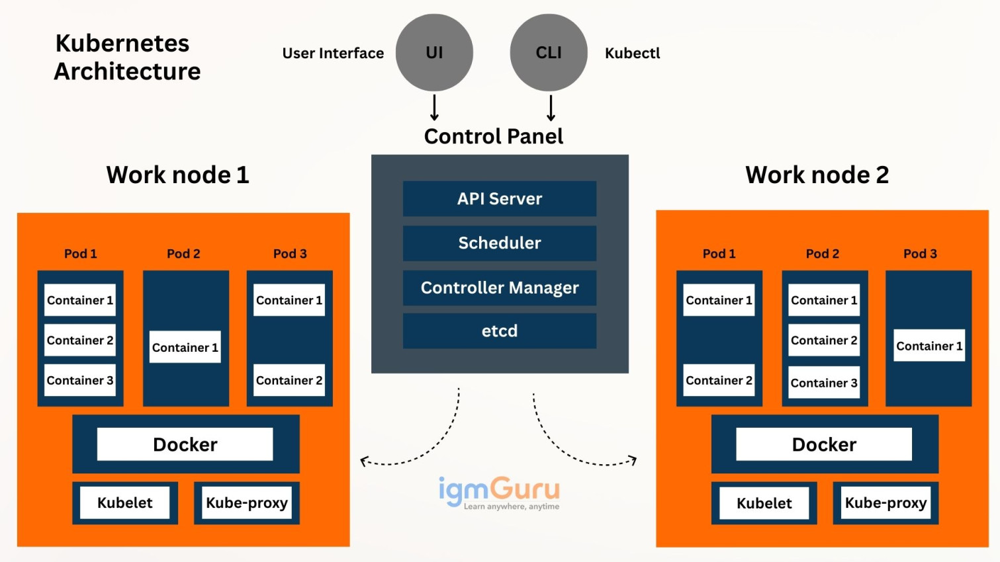

#### Control Plane

manages the cluster

- API Server: entry point for all communication
- Scheduler: assigns Pods to Nodes
- Controller Manager: ensures desired state is maintained
- etcd: stores cluster state (key-value database)

#### Worker Nodes

run applications

- kubelet: communicates with the Control Plane and manages Pods
- kube-proxy: handles networking and service routing
- Container Runtime (e.g., containerd): runs containers

Worker Nodes run Pods, which contain the application containers.

Each service is deployed with:

- `Deployment` — manages pods and rolling updates
- `Service` — ClusterIP for internal communication, LoadBalancer/NodePort for external
- `ConfigMap` — non-sensitive configuration
- `Secret` — sensitive values (DB passwords, JWT secret)
- `ingress` - To understand how traffic gets from the internet to your application, you have to look at Ingress as the "Front Door" of your cluster (for more details in `ALB Controller and Ingress` section we talk more).

Acts as the "Front Door" of the cluster for external traffic coming from the internet.

**Why this combination?**
It follows Kubernetes best practices:  Decouples configuration from code (ConfigMap + Secret)  
Provides stable networking (Service)  
Enables safe updates and scaling (Deployment)  
Efficient external exposure (Ingress + ALB)

---


## AWS

- It is a platform that offers cloud computing solutions
- the platform is developed with a combination of infrastructure as a service (IaaS) , platform as a Service (PaaS) and Software as a Service (SaaS)

### Services of AWS

AWS provides lot of service bu in this project we just talk about some service that we use :

**AWS RDS** : (Amazon Relational Database Service)is a cloud-based service from AWS that simplifies setting up, operating, and scaling relational databases

handling administrative tasks like patching, backups, and scaling to let users focus on their applications. It supports familiar engines such as PostgreSQL, MySQL, MariaDB, SQL Server, Oracle, and its own Aurora, offering cost-efficiency, high availability, and pay-as-you-go pricing

**AWS EKS (Amazon Elastic Kubernetes Service)** is a managed service that simplifies running **Kubernetes** on **AWS** by handling the complex control plane management
    - **Eksctl** = is a simple command line tool for creating and managing kubernetes clusters on Amazon EKS.

**AWS ALB :** is a Load balancer.

**AWS EC2 Instance (Elastic Compute Cloud)** is the most fundamental building block of AWS—it is a virtual server (Infrastructure as a Service) where you have full "Root" or "Administrator" access.

- ***OS Control:*** You choose the operating system (Amazon Linux, Ubuntu, Windows, etc.).

- ***Flexibility:*** You can choose exactly how much CPU, RAM, and Storage you need.

### getting started with practice:

1. Prerequisites

Before creating an Amazon EKS cluster, you need:

- **kubectl** :  interact with Kubernetes cluster.
- **eksctl** :  create/manage EKS clusters easily.
- **AWS CLI** :  connect your local machine to AWS.
- **IAM permissions** :  allow CLI to create resources.

#### **Phase 1:** Infrastructure Provisioning

Before deploying your Docker containers, you need the "home" for your services and your data.

1. Install Tools

    - Go to: <https://chocolatey.org/install>
    - Follow instructions.

After successfully installing Chocolatey, you can use the following commands to install different CLI tools:

2. Install required CLIs :

    ```bash 
    choco install awscli
    choco install kubernetes-cli
    choco install eksctl 
    ```

    - Why These Tools?  
        - The **AWSCLI** is a powerful tool that allows users to interact with various AWS resources and services through a command-line interface.
        - **kubectl** to manage Kubernetes resources (pods, services, deployments) 
        - eksctl tool to create and manage EKS clusters

3. Connect AWS using CLI
    - **required :**  create AWS Account you can use Free trial aws
    - Generate Access Keys :
        - Sign in to the AWS Management Console using your root user credentials
        - Open the AWS Management Console and navigate to the AWS Identity and Access Management (IAM) service.
        - Inside IAM click manage Access Keys
        - Click create access key and download .csv file

4. Connect CLI to AWS
    - Open CMD
    - run command `aws configure`
    - Enter `AWS Access Key ID` and `AWS secret access key`

5. Eksctl
    - What is EKSCTL ?
        eksctl is a simple command line tool for creating and managing Kubernetes clusters on Amazon EKS. https://eksctl.io/.

        We can create a basic cluster in minutes with just one command : 
        `eksctl create cluster`, but the cluster will be created with default parameters.

        But we might need some customization so either we can :
        - create a yaml file `cluster.yaml` e.g.
        - Give params in command line e.g. 

    eksctl provides the fastest and easiest way to create a new cluster with nodes for Amazon EKS  

    so we can create eks cluster using below command :

    `eksctl create cluster --name eks-cluster-1 --region eu-west-2 --nodegroup-name node-group --node-type t3.large --nodes 4 --nodes-min 2  --nodes-max 8  --managed`

    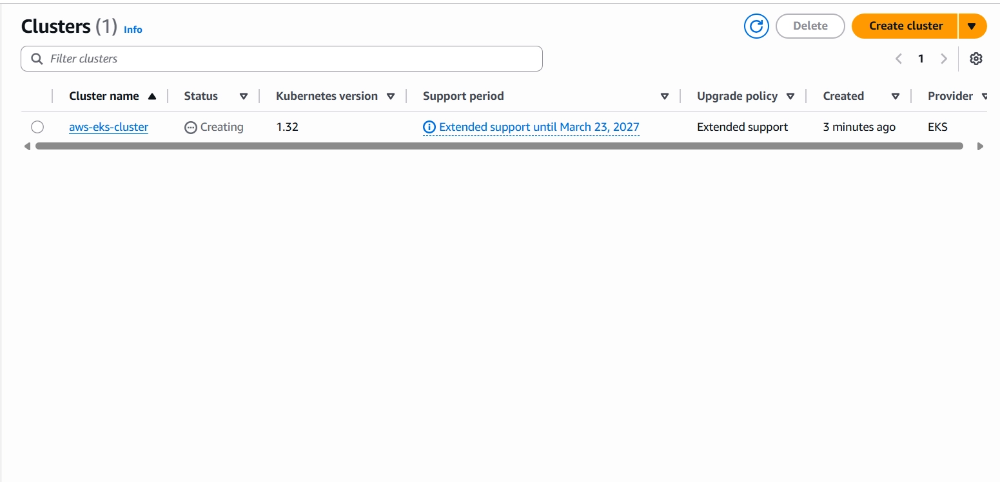

    when finished verify cluster is ready  with :

    ```bash
    kubectl get nodes
    ```

    or check UI :

    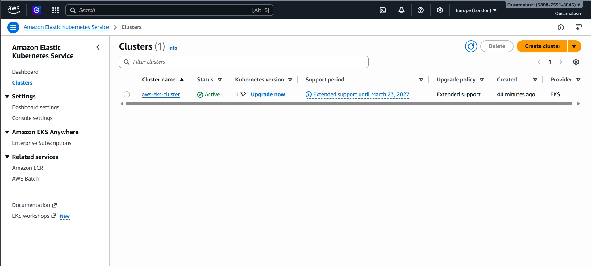


    When the eksctl create cluster command completes successfully, it generates the
    kubeconfig file with the appropriate configurations, including the cluster's endpoint,
    authentication details, and other necessary information. This kubeconfig file is then
    stored on your local machine in the default location

    Tasks done by this simple command : 

    - **Node Group Creation:** eksctl provisions the specified node group(s) within the EKS
    cluster. This involves launching EC2 instances or Fargate pods as worker nodes
    that join the cluster. The command sets up the necessary configuration, such as
    instance types, instance profiles, and scaling options.

    - **kubeconfig Update:** Once the cluster, control plane, and node groups are created,
    eksctl updates the kubeconfig file on your local machine. The kubeconfig file is
    configured with the necessary authentication details, cluster endpoint, and other
    configurations required to connect to the EKS cluster using tools like kubectl.

    - **IAM Role Creation:** eksctl creates an IAM role for the EKS cluster's control plane.
    This role grants necessary permissions to manage the cluster and its resources.

    - **VPC Creation**: If a VPC is not already available, eksctl creates a new Amazon
    Virtual Private Cloud (VPC) with the required subnets, routing, and security groups.
    This VPC will be used for the EKS cluster's networking.

    - **Control Plane Provisioning:** Control plane is a master node. The command
    provisions the EKS control plane, which manages the cluster's resources,
    networking, and scaling. eksctl interacts with the Amazon EKS service to create and
    configure the control plane components.

    - **Cluster Verification:** After the cluster creation process, eksctl performs verification
    checks to ensure the cluster is successfully provisioned and accessible. It confirms
    that the nodes are running and communicating with the control plane ..

    **Kubeconfig :**

    - The kubeconfig file is necessary for authenticating and accessing the EKS cluster.

    - By default, the kubeconfig file is updated with the necessary information to connect to the newly created EKS cluster, allowing you to use tools like kubectl to interact with the cluster from your local machine..

6. RDS (SQL DB )
    - Why AWS RDS ?
        - We can Deploy Our DB also as a Deployment / POD 

        - But what if POD crashes?

        - Your data is lost and that's the task of DB - to manage data

        - So now u have following options

            - Deployments with Persistent volumes - but not recommended bcz its for stateless apps
            - Stateful set with PV - difficult to manage n create
            -   Best way is to segregate it completely outside the cluster 
            - So use AWS RDS

    - What is AWS RDS ?

        **AWS RDS** is a fully managed relational database service that makes it easy to set up, operate, and scale databases in the cloud

        By leveraging AWS RDS, you can quickly provision database instances, scale resources up or down as needed, and easily manage your databases using the AWS Management Console, CLI, or APIs. This allows you to focus on building applications without worrying about the underlying infrastructure and maintenance of your databases

        AWS RDS supports multiple popular relational engines:
        - MySQL
        - PostgreSQL
        - MariaDB
        - Oracle
        - Microsoft SQL Server

    - How to setup AWS RDS ?
        1. Sign in to the AWS Management Console
        2. Once you're logged in, search for "RDS" in the AWS Management Console search bar or locate the "Database" category and click on "Aurora and RDS"
        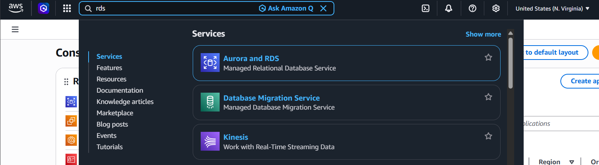
        3. On the RDS dashboard, click on the "Create database" . then choose:
        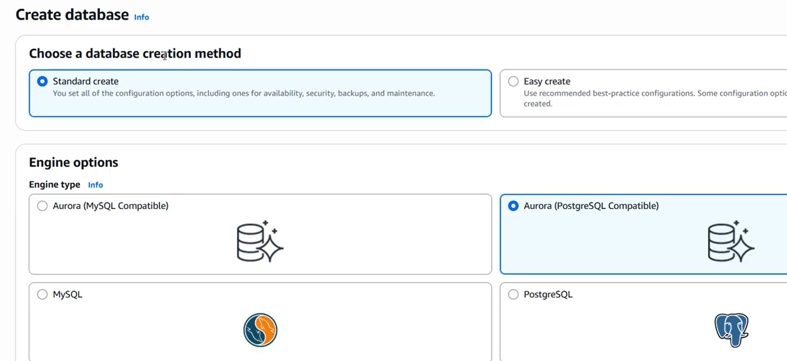
        4. Choose Database Engine e.g.
        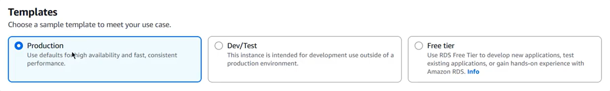
        5. Choose Template
        
        6. DB Instance Configuration
            DB Instance Identifier → Unique name (e.g., my-db-instance)
            Master Username → Database admin username
            Master Password → Secure password

            u can also choose the instance size, allocated storage, and other configuration options according to your needs.

        7. Configure additional settings: Set up the remaining configuration options, such as the Virtual Private Cloud (VPC) and security groups for network access, database port number (e.g.3306 for MySQL, 5432 for PostgreSQL), backup settings, maintenance preferences, etc. Adjust these settings based on your requirements.

        8. Access and manage your RDS instance: Once the RDS instance is created successfully, you can access it using various methods like connecting through an application, using a database management tool, or connecting via the AWS Command Line Interface (CLI). The specific steps for accessing and managing your RDS instance will depend on the database engine you chose.
        eg : 
        

7. Mongodb Atlas ( NOSQL DB )
    - What is Mongo DB Atlas ?

        MongoDB Atlas is a fully managed cloud database service provided by

        It allows you to deploy, manage, and scale MongoDB databases on the cloud infrastructure of your choice, such as Amazon Web Services (AWS), Google Cloud Platform (GCP), or Microsoft Azure.

        MongoDB Atlas simplifies the process of deploying and managing MongoDB databases, allowing you to focus on building your applications

    - How to setup MongoDB Atlas

        1.  Sign in to [MongoDB Atlas](https://www.mongodb.com/cloud/atlas)

        2. Deploy a Cluster :

            `A "cluster" is the set of servers that will host your databases.`

            From the Project Overview, click + Create to start the cluster creation

            For better performance, choose a region close to your Kubernetes (K8s) cluster

            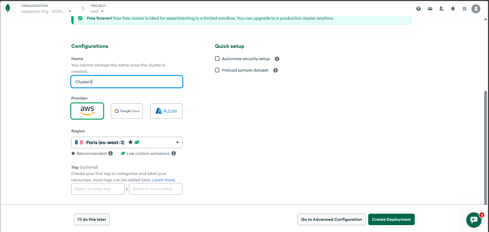

        3. Set Up Connection Security

           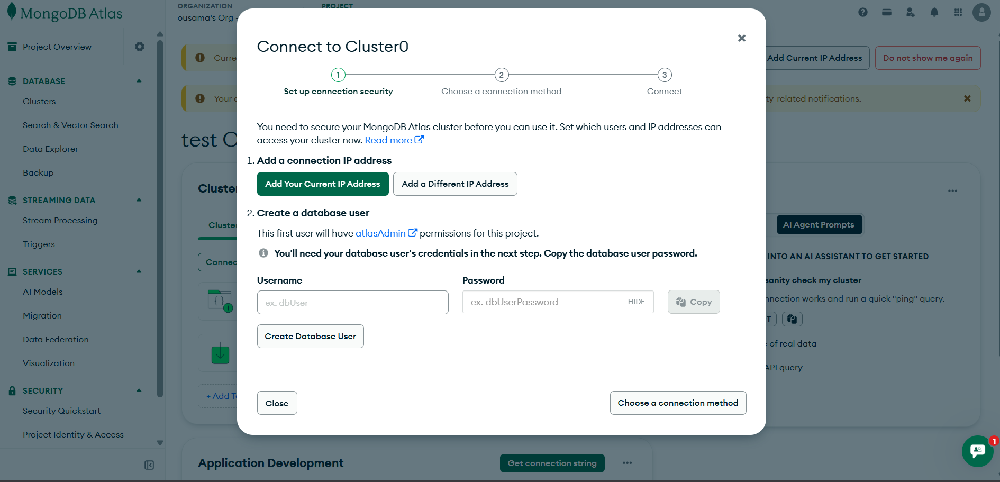

        - Add a Connection IP Address :

            Alternatively, you can allow access from anywhere (0.0.0.0/0), but this is not recommended for production environments.

        -  Create a Database User

            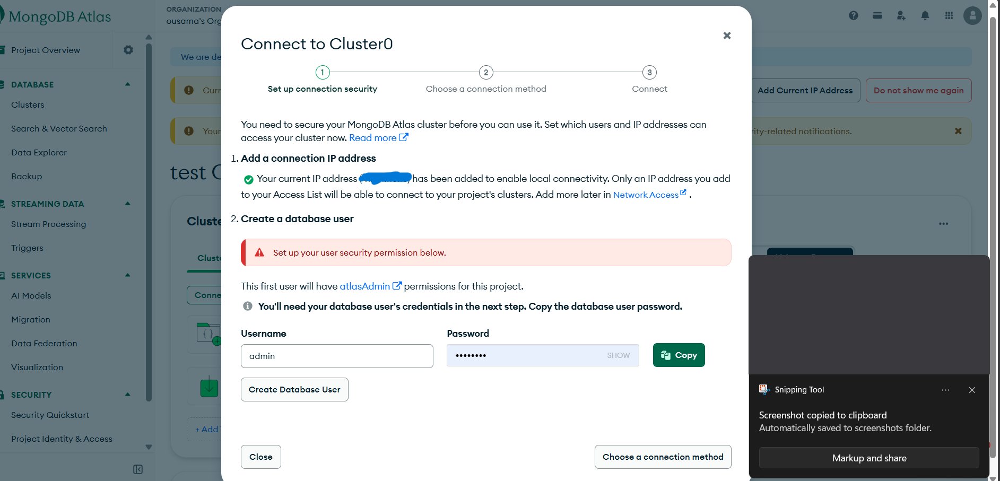

        4. Connect with MongoDB Compass (GUI)
            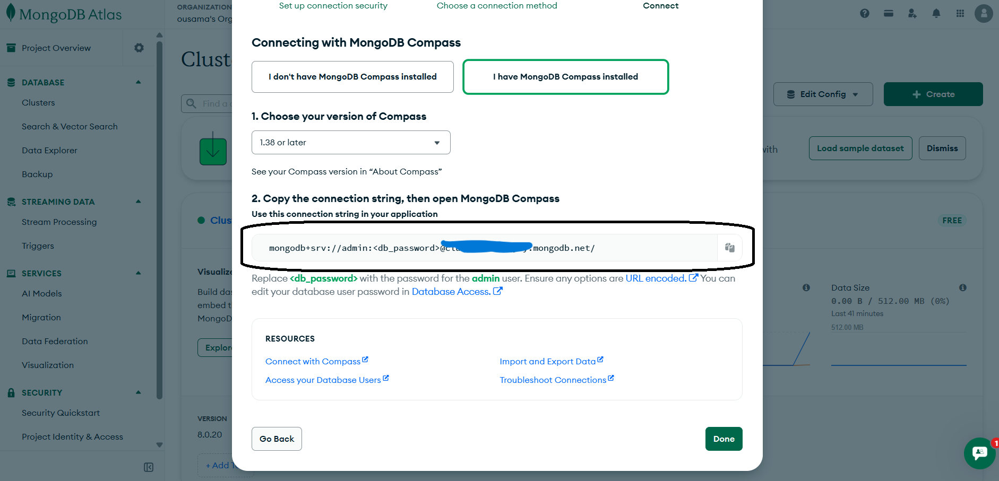
        - Copy the connection string provided by MongoDB Atlas.
            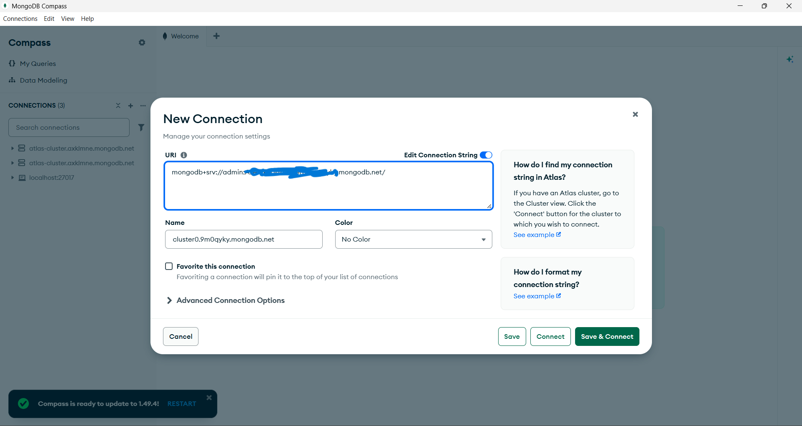
        - Replace <db_password> with your actual database user password.
        - Paste the connection string into MongoDB Compass to connect to your cluster.

        u are Connected

8. Manifest file
    1. Kubernetes manifest files
        - What is kubernetes manifest file

            A Kubernetes manifest file is a configuration file written in YAML or JSON that defines how Kubernetes should deploy and manage your application.

            It acts like a blueprint, describing the desired state of your system.

            A Kubernetes manifest file typically includes definitions for various Kubernetes objects, such as deployments, services, pods, replicaSets, configMaps, secret and more. These objects represent the building blocks of your application or system and define how they should be created, configured, and orchestrated within the Kubernetes cluster.

        - Manifest file creation
            - **Declarative Configuration** : Manifest files describe the desired state of your application and infrastructure in a Kubernetes cluster

            - **Infrastructure as Code (IaC)** : Manifest files allow you to treat infrastructure configuration as code, enabling version control, review, and collaboration
                - Real-World Flow (Simple)
                    - Write YAML
                    - Push to Git
                    - Team reviews
                    - CI/CD deploys to Kubernetes
                    - Kubernetes ensures desired state
                    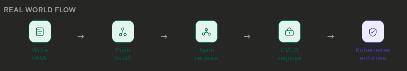
            - **Automation and Orchestration**  : Kubernetes uses manifest files to automate and orchestrate deployment, scaling, updating, and deletion of resources

            - **Reproducibility & Portability** : Manifest files allow you to recreate environments easily and move applications across different clusters or cloud providers

            - **Collaboration & Sharing** : Manifest files serve as a common language for teams, facilitating sharing, collaboration, and best practice adoption.

            - **Resource Management** : Manifest files define and manage various Kubernetes resources, specifying resource requirements, networking, storage, and other parameters.


    2. Manifest file creation

        - **Deployment manifest file**  
            The Deployment manifest defines how your application pods are created and managed.

            *example* :

                ```yml
                apiVersion: apps/v1                     
                    kind: Deployment                    
                    metadata:                       
                    name: my-app
                    labels:
                        app: my-app
                    spec:
                    replicas: 2
                    selector:
                        matchLabels:
                        app: my-app
                    template:
                        metadata:
                        labels:
                            app: my-app
                        spec:
                        containers:
                            - name: my-app
                            image: my-dockerhub/my-app:latest
                            imagePullPolicy: Always
                            ports:
                                - containerPort: 8080
                            env:
                                - name: DB_USERNAME
                                valueFrom:
                                    secretKeyRef:
                                    name: my-secret
                                    key: db-username
                                - name: DB_PASSWORD
                                valueFrom:
                                    secretKeyRef:
                                    name: my-secret
                                    key: db-password
                                - name: DB_NAME
                                valueFrom:
                                    configMapKeyRef:
                                    name: my-configmap
                                    key: db-name
                ```

            `apiVersion`  API version of the Kubernetes object (`apps/v1`)<br>
            `kind`  Type of object (`Deployment`)<br>
            `replicas`  Number of pod instances to run <br>
            `selector.matchLabels` | Identifies which pods belong to this Deployment<br>
            `image`  Container image to pull and run <br>
            `imagePullPolicy: Always`  Always pulls the latest image from <br>the registry <br>
            `containerPort`  Port exposed inside the container <br>
            `env`  Environment variables injected into the container <br>
            `secretKeyRef`  Pulls a value from a Kubernetes Secret <br>
            `configMapKeyRef`  Pulls a value from a Kubernetes ConfigMap <br>

        - **Service manifest file**  
            The Service manifest exposes your application pods to network traffic.

            *example*

            ```yaml
                apiVersion: v1
                kind: Service
                metadata:
                name: my-app-service
                spec:
                selector:
                    app: my-app
                ports:
                    - protocol: TCP
                    port: 8080
                    targetPort: 8080
                type: ClusterIP
            ```

             `apiVersion`  API version (`v1`)  
             `kind`  Type of object (`Service`)  
             `selector`  Matches pods with the given label  
             `port`  Port exposed by the Service  
             `targetPort`  Port on the pod that receives the traffic  
             `type`  Service type (`ClusterIP`, `NodePort`, or `LoadBalancer`) 


        - Configmap manifest file  
            The ConfigMap stores non-sensitive configuration data as key-value pairs.  
            
            ```yaml
            apiVersion: v1
            kind: ConfigMap
            metadata:
                name: my-configmap
            data:
                db-name: mydatabase
                db-host: "jdbc:mysql://my-db-host.example.com:3306/mydatabase"
                app-env: production
            ```

             `apiVersion`  API version (`v1`)  
             `kind`  Type of object (`ConfigMap`)  
             `data`  Key-value pairs of configuration values  
             > **Note:** ConfigMaps are intended for non-sensitive data only. Do **not** store passwords or tokens here.

        - Secret manifest file  
        The Secret manifest stores sensitive data (e.g., passwords, tokens) as base64-encoded values.

            ```yaml
            apiVersion: v1
            kind: Secret
            metadata:
            name: my-secret
            type: Opaque
            data:
            db-username: YWRtaW4=       # base64 encoded value of "admin"
            db-password: cGFzc3dvcmQ=   # base64 encoded value of "password"
            ```
         `apiVersion`  API version (`v1`)  
         `kind`  Type of object (`Secret`)  
         `type: Opaque`  Generic secret with base64-encoded data  
         `data`  Key-value pairs where values are base64-encoded  
 
        **Encoding a value to base64:**  

            ```bash
            echo -n "mypassword" | base64
            # Output: bXlwYXNzd29yZA==
            ```
        > **Warning:** Base64 encoding is **not** encryption. Always use RBAC and restrict access to Secrets in production environments.
        
9. Kubectl  
    Now that the manifest files are ready, we use `kubectl` to interact with the Kubernetes cluster.

    - What is Kubectl  ?  
        `kubectl` is the command-line tool that allows us to create, update, and manage resources defined in our manifest files.

    - Important Kubectl commands
        **Apply the manifests**
 
        ```bash
        # Applies all YAML files in the current directory to create or update resources in the cluster
        kubectl apply -f .
        ```
        > **Why this order?** The Deployment depends on the ConfigMap and Secret being available first, so make sure all files are in the same directory.

        **Verify everything is running** :

            ```bash
            # Lists all running pods in the cluster along with their current status
            kubectl get pods
            
            # Lists all services in the cluster along with their details
            kubectl get svc
            
            # Lists all config maps in the cluster along with their details
            kubectl get configmap
            
            # Lists all secrets in the cluster along with their details
            kubectl get secret
            
            # Lists all deployments in the cluster along with their details
            kubectl get deployment
            ```
        **Inspect and troubleshoot**

            ```bash
            # Displays the logs of a specific pod identified by its name
            kubectl logs <pod-name>
            
            # Executes the 'env' command inside a specific pod to display its environment variables
            kubectl exec <pod-name> -- env
            ```

        **Delete the resources**
    
        ```bash
        # Deletes a specific deployment identified by its name
        kubectl delete deployment <deployment-name>
        
        # Deletes a specific service identified by its name
        kubectl delete svc <svc-name>
        ```
    


10. Load Balancer and AWS Load Balancer

## Testing JUnit

## Continuous Integration (CD) / Continuous Deployment (CD) Pipeline

1. What is Continuous Integration (CI) ?
2. What is Continuous Deployment (CD) ?

### Sonarqube

### CI using Jenkins

1. What is Jenkins ?
2. Jenkins File
Understanding Jenkins file

### Argo CD

